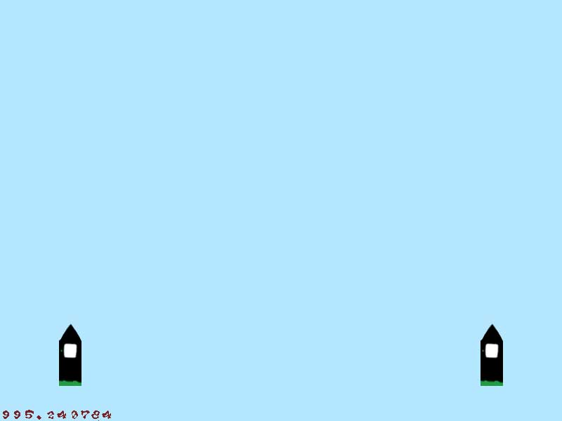

# Hunger Strike!

> A chapter of featherless' [digital creative history](https://github.com/featherless/digital-creative-history).

- When: March 24-27, 2006
- Where: Waterloo, Ontario, Canada
- Platform: Windows
- Team: Jeff Verkoeyen, Joshua Rodasti, Morganne
- Confirmed to build and run with Visual Studio Community 2015 as of April 17, 2016.

## What was it?

A video game created from scratch in 72 hours as part of the
[72 Hour Game Development Competition](https://github.com/featherless/72hourgdc).

Our team, GameDev Guys, won first place in the competition.

The game was a 2d side scroller in which you cast spells using a simple gesture system in order to
progress through three distinct levels.

## Original ideas

We always began each competition with a couple hours of quick brainstorming. One of the first ideas
we explored involved two towers intent on the destruction of the other.

We wanted to use a simple gesture system to cast spells and started jotting down ideas for how we
might make that work with a mouse. We settled on a circle of icons to which we could draw arbitrary
paths.

We started working on our first iterations of the gameplay mechanics:

But we weren't super excited about it.

We decided to pivot from this idea after the first day (and some sleep deprevation) into a game
where you blow up zombies by punching them and casting spells. This led to what you now see here as
Hunger Strike!

## Misc photos

My schematics for planning out the game's internal state machine:

My reference books:

My working area:

## Soundtrack

[The soundtrack is available on Soundcloud](https://soundcloud.com/featherless-digital-creative-history/sets/2006-hunger-strike).

## Reviews

The following reviews were submitted as part of the 72 hour game development competition's judging
process.

- Nice Game, but way too hard!
- VERY strong entry...Great job...Only complaint, didn't care for the gestures system...Overall
  though, excellent work...:)
- Artistically, the game was brilliant.  The music and graphics were both top of their game. 
  Unfortunately, the gameplay didn't do much for me.  It was repetitive, and the spells hurt me more
  often then they helped me.
- General gameplay looked a bit undynamic at times, but it's still very impressive :)
- This game is very well polished, the presentation is good and it's playable too with varied
  levels.  The gameplay is engaging and difficult too, but for the right reasons ie. it presents a
  challenge to the player's skill which is beatable, not unfair and keeps you coming back despite
  how badly you do the first time.
- Really good work!
- Perhaps not the team's most inspired game so far, but definitely an accomplished entry that will
  score deservedly high.

## License

All source code is licensed Apache 2.0 unless otherwise noted below:

- [DevIL is licensed LGPL](http://openil.sourceforge.net/license.php).
- [FMOD is free for non-commercial use](https://www.fmod.org/files/public/LICENSE.TXT).

All music and art are licensed under [Attribution-NonCommercial-NoDerivs 3.0](https://creativecommons.org/licenses/by-nc-nd/3.0/us/).

> A chapter of featherless' [digital creative history](https://github.com/featherless/digital-creative-history).
